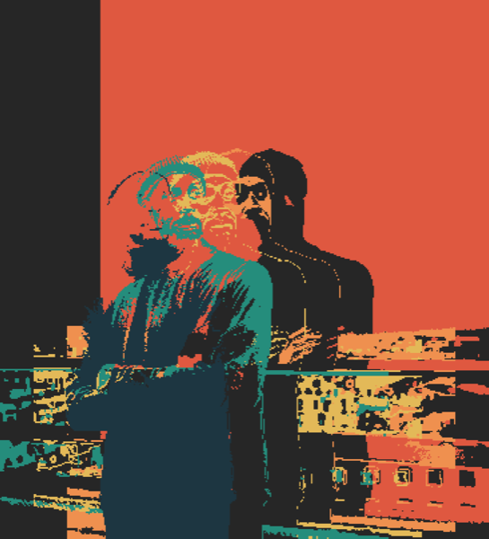

+++
categories = ["art"]
date = 2021-02-05T16:50:00Z
tags = ["art", "R", "genuary"]
title = "#genuary 2021"
type = "post"
url = "/blog/2021/02/genuary-2021"

+++
This year was the first [#genuary](https://genuary2021.github.io/). It was really fun, I did more plots than I expected and learned **a lot**! All the plots were made in R, the code for every one of them is available on GitHub: https://github.com/gkaramanis/aRtist/tree/main/genuary

&nbsp;&nbsp;  
&nbsp;&nbsp;  
JAN.1 (credit: Piter Pasma)  
`// TRIPLE NESTED LOOP `  

&nbsp;&nbsp;  
&nbsp;&nbsp;  
JAN.2 (credit: Harold)  
`Rule 30 (elementary cellular automaton)`  

  

&nbsp;&nbsp;  
&nbsp;&nbsp;  
JAN.3 (credit: Sam Corzine)  
`Make something human.`  

&nbsp;&nbsp;  
&nbsp;&nbsp;  
JAN.4 (credit: Louis-André Labadie)  
`Small areas of symmetry.`  

&nbsp;&nbsp;  
&nbsp;&nbsp;  
JAN.5 (credit: Louis-André Labadie)  
`Do some code golf! How little code can you write to make something interesting? Share the sketch and its code together if you can.`  

  

&nbsp;&nbsp;  
&nbsp;&nbsp;  
JAN.6 (credit: Stevan Dedovic)  
`Triangle subdivision.`  

&nbsp;&nbsp;  
&nbsp;&nbsp;  
JAN.7 (credit: Louis-André Labadie)  
`Generate some rules, then follow them by hand on paper.`  

&nbsp;&nbsp;  
&nbsp;&nbsp;  
JAN.8 (credit: Licia He)  
`Curve only.`  

&nbsp;&nbsp;  
&nbsp;&nbsp;  
JAN.9 (credit: Sam Corzine)  
`Interference patterns.`  

&nbsp;&nbsp;  
&nbsp;&nbsp;  
JAN.10 (credit: Piter Pasma)  
`// TREE`  

  

&nbsp;&nbsp;  
&nbsp;&nbsp;  
JAN.11 (credit: Piter Pasma)  
`Use something other than a computer as an autonomous process (or use a non-computer random source).`  

&nbsp;&nbsp;  
&nbsp;&nbsp;  
JAN.12 (credit: Jonathan Barbeau)  
`Use an API (e.g. the weather). Here’s a huge list of free public APIs.`  

&nbsp;&nbsp;  
&nbsp;&nbsp;  
JAN.13 (credit: Louis-André Labadie)  
`Do not repeat.`  

&nbsp;&nbsp;  
&nbsp;&nbsp;  
JAN.14 (credit: Piter Pasma)  
`// SUBDIVISION`  

  
  

&nbsp;&nbsp;  
&nbsp;&nbsp;  
JAN.15 (credit: Louis-André Labadie)  
`Let someone else decide the general rules of your piece.`  

&nbsp;&nbsp;  
&nbsp;&nbsp;  
JAN.16 (credit: Aaron Penne)  
`Circles only`  

&nbsp;&nbsp;  
&nbsp;&nbsp;  
JAN.17 (credit: Louis-André Labadie)  
`Draw a line, pick a new color, move a bit.`  

  
  

&nbsp;&nbsp;  
&nbsp;&nbsp;  
JAN.18 (credit: Piter Pasma)  
`One process grows, another process prunes.`  

&nbsp;&nbsp;  
&nbsp;&nbsp;  
JAN.19 (credit: Piter Pasma)  
`Increase the randomness along the Y-axis.`  

&nbsp;&nbsp;  
&nbsp;&nbsp;  
JAN.20 (credit: Aaron Penne)  
`No loops.`  

&nbsp;&nbsp;  
&nbsp;&nbsp;  
JAN.21 (credit: Harold)  
`function f(x) { `  
`    DRAW(x);`  
`    f(1 * x / 4);`  
`    f(2 * x / 4);`  
`    f(3 * x / 4);`  
`}`

&nbsp;&nbsp;  
&nbsp;&nbsp;  
JAN.22 (credit: Louis-André Labadie)  
`Draw a line. Wrong answers only.`  

&nbsp;&nbsp;  
&nbsp;&nbsp;  
JAN.23 (credit: Richard Vigniel)  
`&#35264653 &#352a9d8f &#35e9c46a &#35f4a261 &#35e76f51, no gradients.`  
`Optionally, you can use a black or white background.`  

  

&nbsp;&nbsp;  
&nbsp;&nbsp;  
JAN.24 (credit: Aaron Penne)  
`500 lines.`  

&nbsp;&nbsp;  
&nbsp;&nbsp;  
JAN.25 (credit: Piter Pasma)  
`Make a grid of permutations of something.`  

&nbsp;&nbsp;  
&nbsp;&nbsp;  
JAN.26 (credit: Stevan Dedovic)  
`2D Perspective.`  

&nbsp;&nbsp;  
&nbsp;&nbsp;  
JAN.27 (credit: Aaron Penne)  
`Monochrome gradients without lines.`  

&nbsp;&nbsp;  
&nbsp;&nbsp;  
JAN.28 (credit: Louis-André Labadie)  
`Use sound.`  

&nbsp;&nbsp;  
&nbsp;&nbsp;  
JAN.29 (credit: Aaron Penne)  
`Any shape, none can touch.`  

---
&nbsp;&nbsp;  
&nbsp;&nbsp;  
JAN.30 (credit: Jonathan Barbeau)  
`Replicate a natural concept (e.g. gravity, flocking, path following).`  

&nbsp;&nbsp;  
&nbsp;&nbsp;  
JAN.31 (credit: Piter Pasma)  
`10 SEARCH FOR "ENO'S OBLIQUE STRATEGIES"`  
`20 OBTAIN ONE`  
`30 THAT IS YOUR PROMPT FOR TODAY`  

